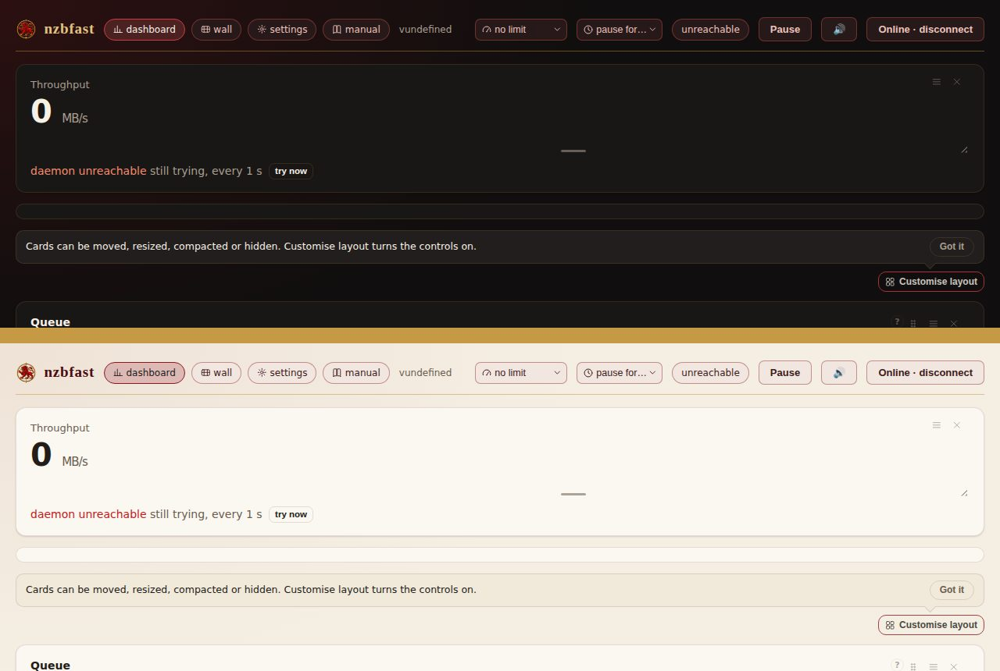

# Cavanagh Family nzbfast Theme

A light/dark theme for a self-hosted [nzbfast](https://github.com/nzbfast/nzbfast)
instance using the Cavanagh Family visual identity. It is the nzbfast companion
to the [Cavanagh Family authentik theme](https://github.com/KaHooli/cavanagh-authentik-theme),
and uses the same palette and heraldic crest.

Package revision: **1.0.0 (4 October 2026)**, reviewed against nzbfast
**v1.7.1**. See [`COMPATIBILITY.md`](COMPATIBILITY.md) for the selectors and
tokens the theme relies on.



## Install

nzbfast loads one user stylesheet: `custom.css` in its config folder, which is
the folder that holds `config.json`. The theme is a single self-contained file;
the crest is embedded in it, because nzbfast serves no other file from that
folder.

### Docker (official image)

The config folder is `/config` inside the container, so the theme goes at
`/config/custom.css`. With the stock `docker-compose.yml` bind mount
(`./config:/config`), from the compose directory:

```sh
curl -fsSL -o ./config/custom.css \
  https://raw.githubusercontent.com/KaHooli/cavanagh-nzbfast-theme/main/custom.css
```

### Other installs

Download [`custom.css`](custom.css) and save it next to your nzbfast
`config.json` (the path in `NZBFAST_CONFIG`, if you set one).

### Activate

Reload the dashboard. nzbfast reads the file on every page load, so you do not
need to restart or rebuild anything. To remove the theme, delete the file.

**Settings > Interface > Theme** selects the palette:

| nzbfast theme | Result |
| --- | --- |
| Auto | Cavanagh light or dark, following the OS |
| Light | Cavanagh light: Warm Ivory ground, Cavanagh Red accent |
| Dark | Cavanagh dark: Charcoal ground, gold hairlines, red accent |
| High contrast | nzbfast's own high-contrast palette, left unchanged on purpose |

Any accent, background, card or text colour, or border strength that you set
in **Settings > Interface** still takes priority over the theme.

## What the theme changes

- **Palette:** nzbfast's shared design tokens (`--bg`, `--surface`, `--fg`,
  `--acc` and so on), so the dashboard and the poster wall change together.
- **Crest:** the Cavanagh crest replaces the lightning-bolt glyph in the
  dashboard header and the wall bar. The click and keyboard behaviour of
  those controls is unchanged.
- **Wordmark:** the header name is set in a serif face, in Deep Oxblood
  (light) or Antique Gold (dark).
- **Gold rule:** a gold rule sits under the header, matching the rule under
  CAVANAGH in the wordmark.
- **Background:** a soft oxblood glow sits in the top-left corner, echoing
  the lion artwork on the authentik backgrounds.

## Brand palette

- Cavanagh Red: `#8F171B`
- Deep Oxblood: `#4A0C10`
- Antique Gold: `#C69A45`
- Warm Ivory: `#F5EFE3`
- Charcoal: `#151515`
- Near Black: `#0C0C0D`

In the dark palette the accent is lifted to `#CC3D42`. nzbfast uses the accent
both as a button fill under white text and as text on cards, and the brand
red is too dark to read as text on a charcoal ground. Error red is moved
toward coral (`#F28B6E`), so an error never looks like a brand-red button.

## Limitations

These come from nzbfast itself, not from the theme:

- **The sign-in page is not themed.** nzbfast does not link `custom.css` on
  `/login`, by design, because that page is served before authentication.
- **The manual (`/manual`) is not themed.** It shares nzbfast's tokens but
  does not link `custom.css`.
- **Browser chrome colour is unchanged.** The address bar and the installed
  app title bar use `<meta name="theme-color">`, which CSS cannot change.
- **The favicon and app icon are unchanged.** They are served from nzbfast's
  binary.

## Repository layout

| Path | Purpose |
| --- | --- |
| `custom.css` | The built, drop-in theme. Do not edit it by hand. |
| `src/cavanagh-nzbfast.css` | Theme source. Edit this file. |
| `branding/cavanagh-crest-96.png` | Crest embedded in the theme, trimmed from the authentik package's `icon-256.png` |
| `tools/build.py` | Embeds the crest and version, then writes `custom.css` |
| `tools/check_contrast.py` | WCAG contrast check for both palettes |
| `VERSION` | Package revision stamped into the built file |
| `PLAN.md` | Design plan and roadmap |
| `COMPATIBILITY.md` | nzbfast frontend review and upgrade checklist |

## Development

```sh
# edit src/cavanagh-nzbfast.css, then:
python3 tools/check_contrast.py
python3 tools/build.py
```

Commit `custom.css` together with the source. CI runs both scripts, plus
`tools/build.py --check`, which fails if `custom.css` is out of date.

To try a change live, copy the built `custom.css` into a test instance's
config folder and reload.
